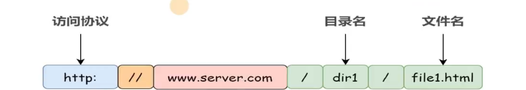
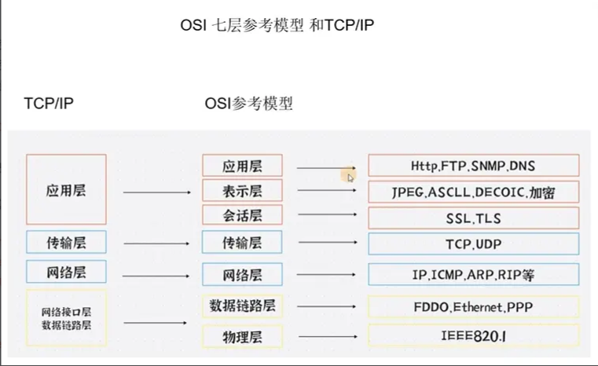
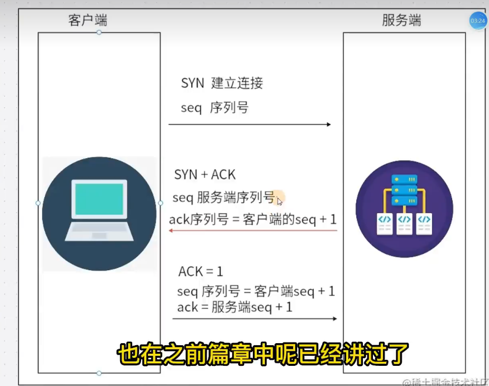
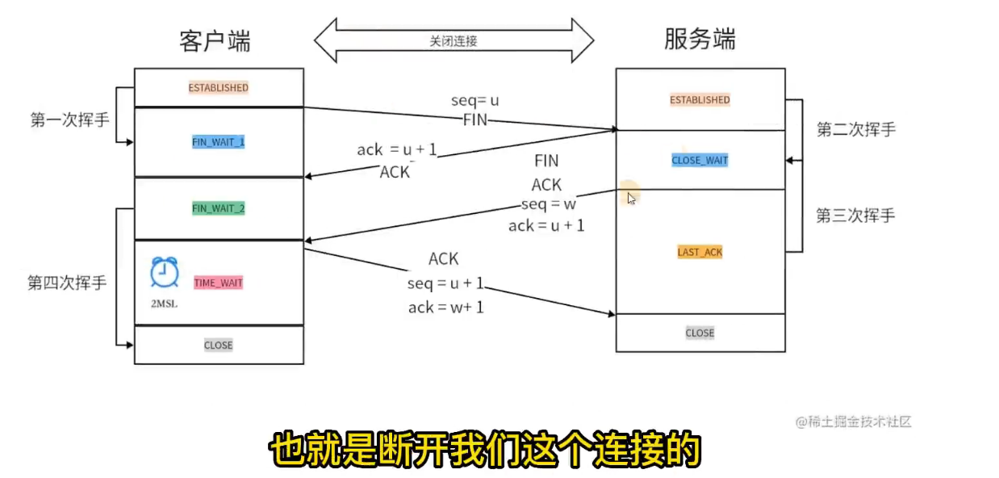
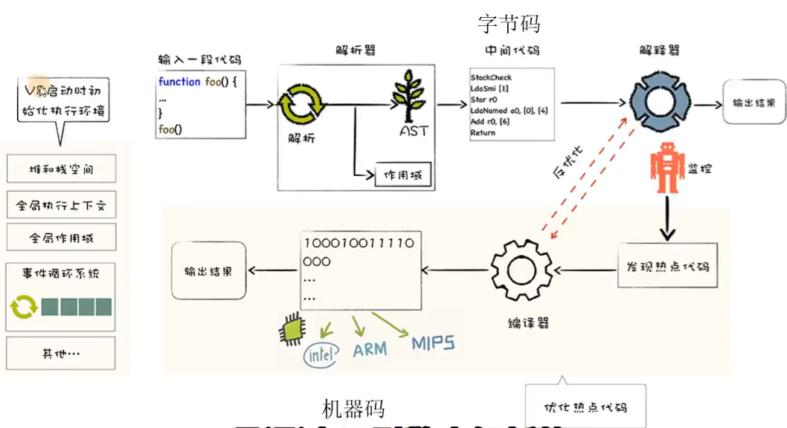

## 浏览器输入 URL 发生了什么

### DNS 查询

一.作用 把地址和 IP 做一个映射 通过对应的域名去找到服务器对应的 ip
查询顺序 1.浏览器自身 DNS 2.操作系统 DNS 3.本地 host 4.向域名服务器发送请求
向域名服务器发送请求规则 1.向根域名服务查找 2.顶级域名服务器 3.权威域名服务器
OSI 七层参考模型和 TCP/IP

二. 三次握手

触发 Options 请求的两种方式 1.跨域 2.自定义请求头
三.进行浏览器缓存 分为强缓存，协商缓存
强缓存 1.浏览器第一次请求资源，服务器返回 200，并在响应头中添加 Cache-Control 和 Expires 字段，表示资源的缓存策略。 2.浏览器再次请求资源时，会先检查 Cache-Control 和 Expires 字段，如果未过期，则直接从缓存中读取资源，返回 200 (from cache)。 3.如果已过期，则浏览器会再次向服务器发送请求，服务器返回新的资源，并更新 Cache-Control 和 Expires 字段。 max-age 比 Expires 优先级高  
协商缓存 1.浏览器第一次请求资源，服务器返回 200，并在响应头中添加 Last-Modified 和 ETag 字段，表示资源的缓存策略。 2.浏览器再次请求资源时，会先检查 Last-Modified 和 ETag 字段，如果未发生变化，则直接从缓存中读取资源，返回 200 (from cache)。 3.如果发生变化，则浏览器会再次向服务器发送请求，服务器返回新的资源，并更新 Last-Modified 修改的最后时间 和 ETag 修改的内容 字段。ETag 优先级高于 Last-Modified

4.四次挥手

拿到 html 页面进行渲染 html 解析器将超文本和标签解析成抽象语法树
css 解析会触发回流与重绘
回流(Reflow)
当页面中元素的位置或尺寸发生改变时，浏览器需要重新计算元素的位置和尺寸，这个过程称为回流。回流会导致浏览器重新布局页面，因此会带来一定的性能开销。常见的导致回流的操作有：
添加或删除可见的 DOM 元素
导致回流的操作 大流 跟大小有关的一定是回流
页面的首次渲染，浏览器窗口大小的改变，元素尺寸或位置发生改变，元素内容变化(文字数量或图片大小)
元素的字体大小变化，添加或删除可见的 DOM 元素，激活 CSS 伪类，滚动条出现或消失，应用 CSS 动画
查询某些属性或调用某些方法 导致重绘的操作
重绘(Repaint) 绘色
当页面中元素样式的改变并不影响它在文档流中的位置时（例如：color、background-color、visibility 等），浏览器会将新样式赋予元素并重新绘制它，这个过程称为重绘。
v8 解析 javaScript

