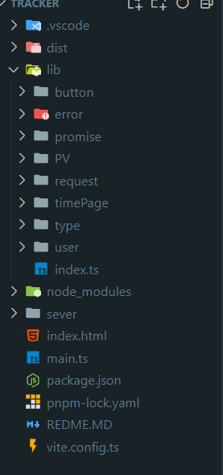

## 埋点

### 埋点概念

PV 是指页面的访问量 Page view 就是用户每次访问页面的记录
UV 是指独立访问量 Unique visitor 就是一个 IP 地址访问某个网站的次数

## 埋点作用

1. 分析用户的行为数据 收起页面浏览量
2. 用户的性能评估 页面加载的事件 api 调用延迟的事件,错误的日志
3. 设备和环境, 用户的操作设备,操作系统,用户角色
4. 用户的属性数据 用户 ID 地理位置,
   核心 统计网站的数据 也就是角色的隐私数据

## 埋点注意事项

1. 请求接口方法不能使用 ajax fetch axios 为什么 因为点击按钮 可能会关闭页面导致页面信息丢失 接口没有走完
2. 必须使用埋点专用接口也就是 navigator.sendBeacon 因为浏览器关闭的时候也会走完这个口
3. navigator.sendBeacon(url, data)
   url 发送的接口地址
   data 发送的数据
   默认是 post 请求
4. 埋点是 ping 请求 传递速度快,信息要简短
5. 不能传递 json 可以利用 blob 传递 json 对象 type 设置 "application/json"
6. 使用 json 会产生跨域问题

## CORS 跨域

请求分两种请求:1.普通请求 2.复杂请求
请求头默认值:Content-Type,默认支持的请求类型 post get head options
普通请求 Content-Type 的值有三种

1. application/x-www-form-urlencoded
2. multipart/form-data
3. text/plain
   默认支持的字段:
   Accept
   Accept-Language
   Content-Language
   Content-Type
   ORigin
   Referer
   User-Agent

## 埋点实现

结构

```md

```

```js
前端: lib/index.ts
import { getUserInfo } from "./user/index";
import button from "./button/index";
import Error from "./error/window";
import promiseError from "./promise/index";
import ajax from "./request/index";
import Pv from "./PV/page";
import onePage from "./timePage/index";
import { Types } from "./type";
export class Tracker {
  events: Record<string, Function>;
  constructor() {
    this.events = { button, Error, promiseError, ajax, Pv, onePage };

    this.init();
  }

  // 静态方法 哪里都可以使用
  public SendRequest(params: Types) {
    const userInfo = getUserInfo();
    const body = Object.assign({}, userInfo, params);
    // 请求接口  axios fetch ajax 在这里都不能使用必须使用埋点专用接口
    // 为什么不能使用 情况 点击按钮  关闭页面 接口没有走完接口 丢失了一条消息
    // navigator.sendBeacon 完美解决解决这个问题 即使浏览器关闭 也要走完这个接口
    // navigator.sendBeacon 默认请求方式是post
    // 注意点1 ping请求 传递速度快 内容要短
    // 注意点2 不能传递json 利用blob传递json对象 设置type "application/json"
    // 注意点3 使用json之后会跨域
    // 注意点4 发送请求的时候 浏览器会自动携带一些信息 比如cookie 这些信息是用户隐私 需要用户授权
    let blob = new Blob([JSON.stringify(body)], {
      type: "application/json",
    });
    navigator.sendBeacon("http://localhost:3000/tracker", blob);
  }

  //只能在自己的类内部使用
  private init() {
    // 插件
    Object.keys(this.events).forEach((key) => {
      // this.events[key] 就是 Button 类的实例
      // this.SendRequest 是 Tracker 类的实例
      //传入this.SendRequest 是为了让Button类里的sendRequest方法可以使用
      this.events[key](this.SendRequest);
    });
  }
  // protected 可以在类里使用也可以在其他使用
}

服务端: serve/index.ts
import express from "express";
import nodemailer from "nodemailer";

const app = express();
// 面试重点
const transporter = nodemailer.createTransport({
  service: "qq",
  port: 465,
  //服务器地址
  host: "smtp.qq.com",
  //签名
  auth: {
    user: "1204662735@qq.com",
    pass: "hyhwaxgcfazfjabd",
  },
});
app.use("*", (req, res, next) => {
  res.setHeader("Access-Control-Allow-Origin", "http://localhost:5173"); //设置 *  或者指定IP
  res.setHeader("Access-Control-Allow-Credentials", "true"); //允许携带cookie
  res.setHeader("Access-Control-Allow-Headers", "Content-Type"); //允许 application/json
  next();
});
// 接受post 请求 接受参数
// app.ues 中间件 作用于所有请求
app.use(express.json());
app.post("/tracker", (req, res) => {
  console.log(req.body); //接受post  query参数 params 接受动态参数
  const body = req.body;
  if (body.type === "error") {
    transporter.sendMail({
      from: "1204662735@qq.com",
      to: "1204662735@qq.com",
      //标题
      subject: "错误信息",
      //内容
      text: JSON.stringify(body),
    });
  }
  // 有序列表
  // redis.rpush("tracker", JSON.stringify(body));
  res.send("ok"); //注意一定要返回简短的东西
});

// 启动服务
app.listen(3000, () => {
  console.log("listening on port 3000");
});

```

## 埋点服务端

```js 后端 serve/index.ts
import express from "express";
import nodemailer from "nodemailer";

const app = express();
// 面试重点
const transporter = nodemailer.createTransport({
  service: "qq",
  port: 465,
  host: "smtp.qq.com",
  //签名
  auth: {
    user: "1204662735@qq.com",
    pass: "hyhwaxgcfazfjabd",
  },
});
app.use("*", (req, res, next) => {
  res.setHeader("Access-Control-Allow-Origin", "http://127.0.0.1:5174"); //设置 *  或者指定IP允许跨域
  res.setHeader("Access-Control-Allow-Credentials", "true"); //允许携带cookie
  res.setHeader("Access-Control-Allow-Headers", "Content-Type"); //允许 application/json
  next();
});
// 接受post 请求 接受参数
// app.ues 中间件 作用于所有请求
app.use(express.json());
app.post("/tracker", (req, res) => {
  console.log(req.body); //接受post  query参数 params 接受动态参数
  const body = req.body;
  if (body.type === "error") {
    transporter.sendMail({
      from: "1204662735@qq.com",
      to: "1204662735@qq.com",
      subject: "错误信息",
      text: JSON.stringify(body),
    });
  }
  // 有序列表
  // redis.rpush("tracker", JSON.stringify(body));
  res.send("ok"); //注意一定要返回简短的东西
});

// 启动服务
app.listen(3000, () => {
  console.log("listening on port 3000");
});
```

## 按钮埋点

```js
html 页面给需要的按钮设置自定义属性<button data-tracker=''><button>
import { Send } from "../type";
export default function button(send: Send) {
  document.addEventListener("click", function (e) {
    const target = e.target as HTMLElement;
    // 获取标签属性
    const tracker = target.getAttribute("data-tracker");
    // 获取元素的属性
    const position = target.getBoundingClientRect();
    if (tracker) {
      // 上报点击按钮
      send({
        type: "event",
        text: tracker,
        data: {
          x: position.x,
          y: position.y,
          width: position.width,
          height: position.height,
        },
      });
    }
  });
}


```

## Promise 埋点

```js
import { Send } from "../type/index";
export default function promiseError(send: Send) {
  // unhandledrejection 捕获全全局的promise错误
  window.addEventListener("unhandledrejection", function (event) {
    console.log("unhandledrejection", event);
    send({
      type: "error",
      text: event.reason,
      data: {
        reason: event.reason,
        path: location.href,
      },
    });
  });
}
```

## Ajax 埋点

```js
import { Send } from "../type";

export default function request(send: Send) {
  // 拦截原生api 就是重写他的方法
  const OriginalOpen = XMLHttpRequest.prototype.open;
  const OriginalSend = XMLHttpRequest.prototype.send;
  //在原型上找他的方法
  XMLHttpRequest.prototype.open = function (
    method: string,
    url: string,
    async: boolean = true
  ) {
    send({
      text: "ajax",
      type: "request",
      data: {
        method,
        url,
      },
    });
    //重写方法绑定原来的this
    OriginalOpen.call(this, method, url, async);
  };
  // 发送
  XMLHttpRequest.prototype.send = function (data: any) {
    send({
      text: "ajax",
      type: "response",
      data: {
        data,
      },
    });
    OriginalSend.call(this, data);
  };
}

export function originFetch(send: Send) {
  const originalFetch = window.fetch;
  window.fetch = function (...args: any[]) {
    send({
      text: "fetch",
      type: "request",
      data: {
        ...args,
      },
    });
    return originalFetch.call(this, ...args);
  };
}
```

## 首屏埋点

```js
import { Send } from "../type";
// 首屏加载时间
export default function onePage(send: Send) {
  let firstScreenTime = 0;
  // 用于监听DOM树的变化
  const ob = new MutationObserver((mutations) => {
    mutations.forEach(() => {
      // 获取页面加载时间
      firstScreenTime = performance.now();
      if (firstScreenTime > 0) {
        send({
          type: "onePage",
          text: "首屏加载时间",
          data: {
            firstScreenTime,
          },
        });
      }
      //停止 监听
      ob.disconnect();
    });
  });
  // childList 子节点发生变化 增删改查  attributes 属性发生变化
  //   subtree所有子节点的变化 包括子节点的后代
  //  如果是vue项目 把document 换成app
  ob.observe(document, { childList: true, subtree: true });
}
```

## pv page view 埋点

```js
import { once } from "nodemailer/lib/xoauth2";
import { Send } from "../type";

export default function Pv(send: Send) {
  // vue 路由的模式 hash ,history
  window.addEventListener("hashchange", (e) => {
    send({
      type: "pv",
      text: location.href,
      data: {
        path: location.href,
        newUrl: e.newURL,
        oldUrl: e.oldURL,
      },
    });
  });
  //   history 模式
  // popstate只能监听浏览器上的箭头
  window.addEventListener("popstate", (e) => {
    send({
      type: "pv-history",
      text: e.type,
      data: {
        url: location.href,
        state: e.state,
      },
    });
  });
  //重写 pushState
  const pushState = history.pushState;
  window.history.pushState = function (state: any, title: string, url: string) {
    const res = pushState.call(this, state, title, url);
    //    创建自定义事件
    const e = new Event("pushState"); //发布订阅
    window.dispatchEvent(e);
    return res;
  };
  window.addEventListener("pushState", (e) => {
    send({
      type: "pv-history",
      text: e.type,
      data: {
        url: location.href,
      },
    });
  });
  //重写replaceState
  const replaceState = window.history.replaceState;
  window.history.replaceState = function (
    state: any,
    title: string,
    url: string
  ) {
    const res = replaceState.call(this, state, title, url);
    //   自定义replaceState 事件
    const e = new Event("replaceState");
    window.dispatchEvent(e);
    return res;
  };
  window.addEventListener("replaceState", (e) => {
    send({
      type: "pv-history",
      text: e.type,
      data: {
        url: location.href,
      },
    });
  });
}
```

## window 错误埋点

```js
import { text } from "express";
import { Send } from "../type";
//  windows捕获不到promise的错误
export default function Error(send: Send) {
  window.addEventListener("error", (event) => {
    console.log(event);
    send({
      type: event.type,
      text: event.message,
      data: {
        line: event.lineno,
        file: event.filename,
      },
    });
  });
}
```

## 埋点类型约束

````js
 lib /type/index.ts
export interface Types<T = Record<string, any>> {
  type: string | null | number | undefined | boolean; //类型;
  text: string;
  data: T;
}
export type Send = <T>(params: Types<T>) => void;
```js
## 埋点设置
```js
export class Tracker {
    // 类型知识
events: Record<string, Function>;
constructor() {
this.events = { button };
this.init();
}
// 静态方法 哪里都可以使用
public SendRequest(params: Types) {
const userInfo = getUserInfo();
// 传递的类容
const body = Object.assign({}, userInfo, params);
let blob = new Blob([JSON.stringify(body)], {
type: "application/json",
});
navigator.sendBeacon("http://localhost:3000/tracker", blob);
}

//只能在自己的类内部使用
private init() {
Object.keys(this.events).forEach((key) => {
// this.events[key] 就是 Button 类的实例
// this.SendRequest 是 Tracker 类的实例
//传入 this.SendRequest 是为了让 Button 类里的 sendRequest 方法可以使用
this.events[key](this.SendRequest);
});
}
// protected 可以在类里使用也可以在其他使用
}
````

## 埋点为什么会发两次请求

1.  排除普通请求
2.  自定义请求头
3.  必须是 Post 并且为 application/json
    只要满足以上条件的一个 就会发送两次请求 浏览器自己发送预检请求

## 埋点存储

埋点数据一般是存入 redis 不存数据库
内存存储比数据库快很多
因为 redis 是内存存储
redis 支持很多数据解构 hash set list 地图 字符库
内存会丢失 原因 重启 宕机
redis 持久化 RDB AOF
底层解构是 B+树 红黑树 二叉树 b 树
而数据库是硬盘存储
