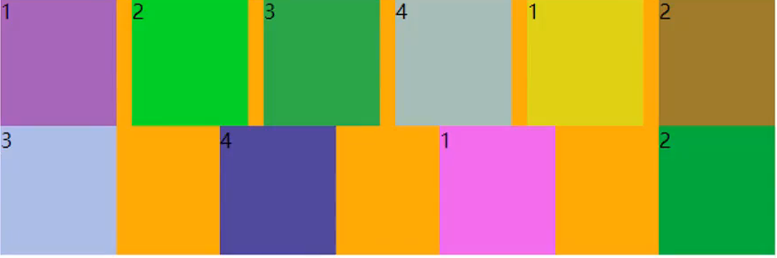

# CSS 笔记

## 1. CSS 简介

CSS（层叠样式表）是一种用于描述 HTML 文档外观的样式表语言。它使得开发者能够控制网页的布局、颜色和字体等视觉效果。

## 2. CSS 选择器

选择器用于选择要应用样式的 HTML 元素。常见的选择器包括：

- **元素选择器**：选择所有指定类型的元素，例如 `p` 选择所有段落。
- **类选择器**：选择具有特定类的元素，例如 `.className`。
- **ID 选择器**：选择具有特定 ID 的元素，例如 `#idName`。
- **属性选择器**：选择具有特定属性的元素，例如 `[type="text"]`。
- **分组选择器**：选择多个元素，例如 `div, p`。
- **通配符选择器**：选择所有元素，例如 `*`。
- **伪类选择器**：选择特定状态的元素，例如 `:hover`、`:active`
- **伪元素选择器**：选择特定伪元素的元素，例如 `::before`、`::after`
- **组合选择器**：选择多个选择器组合在一起的元素，例如 `div p`
- **子选择器**：选择父元素下的子元素，例如 `div > p`
- **兄弟选择器** ：选择相邻的元素，例如 `,`。

## 3. CSS 属性

CSS 属性用于设置元素的样式。常见的属性包括：

- **颜色**：`color`、`background-color`
- **字体**：`font-size`、`font-family`
- **边距和填充**：`margin`、`padding`
- **边框**：`border`

## 4. CSS 布局

CSS 提供多种布局方式，包括：

- **盒模型**：理解元素的宽度、高度、边距、填充和边框。
- **浮动布局**：使用 `float` 属性来实现元素的并排布局。
- **弹性布局**：使用 `display: flex` 来创建响应式布局。
- **网格布局**：使用 `display: grid` 来创建复杂的布局。
- **响应式设计**：使用媒体查询来适配不同的屏幕尺寸。

### 4.1 flex 布局

- **应用在 flex container 上的 css 属性**
  - `flex-direction` ：设置 flex 元素的排列方向
    - `row`：默认值，从左到右排列
    - `row-reverse`：从右到左排列
    - `column`：从上到下排列
    - `column-reverse`：从下到上排列
  - `flex-flow` : 设置 flex-direction 和 flex-wrap 的简写属性
  - `flex-wrap` : 设置 flex 元素的换行方式
    - `nowrap`：默认值，不换行
    - `wrap`：换行，从上到下排列
    - `wrap-reverse`：换行，从下到上排列`
    - `justify-content` : 设置设置 flex 元素的水平对齐方式
      - `flex-start`：默认值，从左到右排列
      - `flex-end`：从右到左排列
      - `center`：居中对齐
      - `space-between`：两端对齐，项目之间的间隔都相等
      - `space-around`：两端对齐，项目之间的间隔都相等，但项目之间的间隔比两端的间隔大一倍
      - `space-evenly`：两端对齐，项目之间的间隔都相等，但项目之间的间隔比两端的间隔大一倍
    - `align-items` : 设置设置 flex 元素的垂直对齐方式
    - `align-content` : 设置设置 flex 元素的垂直对齐方式
- **应用在 flex items 上的 css 属性**
  - `order` : 设置 flex 元素的排序方式
  - `flex-grow` : 设置 flex 元素的扩展比例 设置任意非负数字默认值是 0
  - `flex-shrink` : 设置 flex 元素的收缩比例 设置任意非负数字默认值是 1
  - `flex-basis` : 设置 flex 元素的初始大小 基础尺寸
  - `flex` : 设置 flex-grow、flex-shrink 和 flex-basis 的简写属性
  - `flex-grow flex-shrink flex-basis`
    值为 none 0 0 auto
    值为 auto 1 1 auto
    值为 1
  - `align-self` : 设置 flex 元素的垂直对齐方式
    布局问题
    
