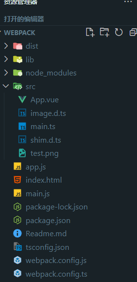

## webpack

## 项目结构



## webpack 概念

本质上，webpack 是一个用于现代 JavaScript 应用程序的 静态模块打包工具。当 webpack 处理应用程序时，它会在内部从一个或多个入口点构建一个 依赖图(dependency graph)，然后将你项目中所需的每一个模块组合成一个或多个 bundles，它们均为静态资源，用于展示你的内容。

### webpack 五大核心

1. entry：入口，指示 webpack 应该使用哪个文件作为构建其内部依赖图的开始。
2. output：输出，指示 webpack 在哪里输出它所创建的 bundles 以及如何命名这些文件，默认值为 ./dist。
3. loader：loader 让 webpack 能够处理那些非 JavaScript 文件（webpack 自身只理解 JavaScript）。loader 可以将所有类型的文件转换为 webpack 能够处理的有效模块。
4. plugins：插件，用于执行范围更广的任务。插件目的在于解决 loader 无法实现的其他事。
5. mode：模式，指示 webpack 使用相应模式的配置。

## webpack 说明

如果以后看到 cli 就是命令行工具
命令行工具调用 npx
webpack5 版本必要要跟 webpack-cli 一起装
npm install webpack webpack-cli 负责打包
webpack-dev-server 负责启动服务

webpack5 自带 treeShaking 树摇技术
声明的变量没有使用，就不会打包进来
以及永远走不进去的 if 会被摇掉
webpack 只能支持 js 天然支持 json
如果要处理文件 loader
要支持 TS 需要 ts-loader 依赖 typescript 安装 npm i ts-loader typescript -D
如果要增加功能 plugin 每一个插件都是一个类

优化编译速度 ts-loader 使用 swc 技术
ts-loader 3431ms
swc-loader 287ms
图片使用 url-loader/file-loader
区别

1. url-loader 默认打包成 base64 file-loader 压缩图片
2. file-loader 没有 limit 压缩图片的大小

## webpack 配置 Vue

1. 配置声明文件.vue

```js 文件
// shim.d.ts
declare module "*.vue" {
  import { DefineComponent } from "vue";
  const component: DefineComponent<{}, {}, any>;
  export default component;
}
```

2. 声明和挂载 APP

```js
import { createApp } from "vue";
import App from "./App.vue";
const app = createApp(App);
app.mount("#app");
```

3. 安装插件 npm i html-webpack-plugin -D 识别 html

```js
  plugins: [
    new htmlWebpackPlugin({
      template: "./index.html",
    }),
    new VueLoaderPlugin(),
  ],
```

4. 安装 vue-loader npm i Vue-loader 以及配置

```js
  { test: /\.vue$/,
    loader: "vue-loader",
    }
```

## webpack vue 支持 TS

```js
安装 npm i -D @swc/core swc-loader
方案一:把 swc-loader 改成 ts-loader
   use:{
          loader: 'ts-loader',
          options: {
                appendTsSuffixTo: [/\.vue$/]
                }
    }
方案二:swc 加一个配置项
    use: {
        loader: "swc-loader",
          options: {
            jsc: {
              parser: {
                  syntax: "typescript",
                  tsx: true,
                },
              },
            },
        },
```

## webpack vue 支持 css

方案一
npm i -D css-loader style-loader
css-loader 作用把 css 文件变成 js 文件
style-loader 作用把 css-loader 处理的结果 动态生成 style 标签插入到 dom 中

```js
  {
    test: /\.css$/,
    use:['style-loader','css-loader'] //顺序从右往左
}
{
  //  npm i less-loader
    test: /\.less$/,
    use:['style-loader','css-loader','less-loader'] //顺序从右往左
}
```

方案二
npm i -D mini-css-extract-plugin
将 css 提取到单独的 css 文件中

```js
  {
    test: /\.css$/,
    use:[MiniCssExtractPlugin.loader,'css-loader'] //顺序从右往左
}
```

## webpack 配置

```js
const { Configuration } = require("webpack"); // 代码提示
const path = require("node:path");
const HtmlWebpackPlugin = require("html-webpack-plugin");
const { VueLoaderPlugin } = require("vue-loader");
const MiniCssExtractPlugin = require("mini-css-extract-plugin"); //将js文件中的css提取到单独的css文件中
// js docs
/**
 *  * @type {Configuration}
 */
const config = {
  //提升打包速度
  cache: {
    type: "filesystem", //,emory 内存缓存 filesystem文件存储在node_modules/.cache
    //自定义缓存的位置
    // cacheDirectory
  },
  mode: "development",
  entry: "./src/main.ts", //入口文件
  output: {
    //出口文件
    filename: "[chunkhash].js", //输出的文件
    path: path.resolve(process.cwd(), "dist"), //输出的文件夹
    clean: true, //每次打包的时候清空上一次打包的结果
  },
  //扩展
  resolve: {
    //后缀
    extensions: [".ts", ".js", ".vue"], //扩展
    alias: {
      "@": path.resolve(process.cwd(), "src"),
    },
  },
  module: {
    //   配置规则
    rules: [
      {
        //ts文件结尾
        test: /\.ts$/, //匹配ts结尾的文件名
        use: {
          loader: "swc-loader",
          options: {
            jsc: {
              parser: {
                syntax: "typescript",
                tsx: true,
              },
            },
          },
        }, //使用loader去处理
        exclude: /node_modules/, //去除某某文件
      },
      //图片文件结尾
      {
        test: /\.(png|jpg|jpeg|gif|svg)$/,
        // 如果use是一个配置项 use必须写成对象
        use: {
          options: {
            limit: 10000, //10kb以下的图片才会被压缩成base64处理
            name: "static/[name].[hash].[ext]", //图片打包后的输出路径
          },
        },
      },
      //   配置vue-loader
      {
        test: /\.vue$/,
        use: "vue-loader",
      },
      //配置 css 结尾
      {
        test: /\.css$/,
        //流程 把css-loader是一段js处理的结果传给 MiniCssExtractPlugin拿到结果动态生成标签
        use: [MiniCssExtractPlugin.loader, "css-loader"], //从右往左的
      },
      //配置sass
      {
        test: /\.scss$/,
        use: [MiniCssExtractPlugin.loader, "css-loader", "sass-loader"],
      },
    ],
  },
  //webpack的所有插件都是类
  plugins: [
    new HtmlWebpackPlugin({
      //指定html代码的位置
      template: "./index.html",
    }),
    //注册插件vue3
    new VueLoaderPlugin(),
    new MiniCssExtractPlugin(),
  ],
  //性能优化 分包 面试重点
  optimization: {
    splitChunks: {
      chunks: "all", //静态模块 动态模块 共享模块 全部拆分
      cacheGroups: {
        // 分包的内容 具体项目
        dayjs: {
          name: "dayjs",
          test: /[\\/]node_modules[\\/]dayjs[\\/]/,
          // 优先级
          priority: 1,
        },
        // 作用 公共的依赖提成一次
        common: {
          name: "common",
          test: /[\\/]node_modules[\\/]/,
          priority: 2,
          minChunks: 1, //最少引用两次
          chunks: "all", //静态模块 动态模块 共享模块 全部拆分
        },
      },
    },
  },
  // 配置cdn
  // extends: {
  //   vue: "Vue",在你打包的vue的时候就不会打包进去
  // },
};
//  cjs commonjs  require module.exports
//  esm import export default
module.exports = config;
```

## webpack 源码

安装依赖
npm i @babel/parser
npm i @babel/traverse
npm i @babel/core
npm i ejs

### type 类型约束

安装 npm i tapable

```js
// 入口
import { SyncHook, AsyncSeriesHook } from "tapable";

export interface Graph {
  deps: string[];
  filePath: string;
  code?: string;
  id: number;
}
//plugin
export interface Hooks<T = unknown> {
  afterPlugins: SyncHook<T>; //插件调用之后执行
  initialize: SyncHook<T>; //插件初始化
  emit: AsyncSeriesHook<T>; //打包之前
  afterEmit: AsyncSeriesHook<T>; //打包之后
  done: AsyncSeriesHook<T>; //打包完成
}
// 一个数组里面放的类 并且类里有apply 方法 ts类型怎么描述
interface Plugin {
  apply: (compiler: any) => void;
}
// webpack配置
export interface Config {
  entry: string;
  output: {
    path: string,
    filename: string,
  };
  //loader
  rules: {
    module: {
      test: RegExp,
      use: ((...args: any[]) => string) | Array<Function>,
    }[],
  };
  Plugins: Plugin[];
}
```

### webpack.config.ts 文件

```js
import path from "node:path";
import type { Hooks } from "./lib/type";
import fs from "node:fs";
// 在esm内容下 没法使用__dirname
//esm有提示 cjs 对TS支持不优化
//webpack的loader
const jsonLoader = (source: string) => {
  // console.log(source);
  return "123";
};
//plugin 必须是一个类
//这个类里面必须有apply方法
// 钩子函数 hooks函数 也就是代表每个阶段在做什么
class webpackPlugin {
  options: { tmp: string };
  // 接受参数
  constructor(options: { tmp: string }) {
    //注入
    this.options = options;
  }
  //插件注入
  apply(hooks: Hooks) {
    let newTem: string = "";
    console.log(hooks);
    // //插件调用之前
    hooks.afterPlugins.tap("webpackPlugin", () => {
      console.log("afterPlugins");
    });
    //插件初始化之前
    hooks.initialize.tap("webpackPlugin", () => {
      console.log("initialize");
      //读
      const tem = fs.readFileSync(this.options.tmp, "utf-8");
      newTem = tem.replace(
        /<head>/,
        '<head><script src="bundle.js"> <script></'
      );
    });
    //打包之前
    hooks.emit.tapPromise("webpackPlugin", () => {
      return new Promise((resolve) => {
        resolve();
      });
    });
    //打包之后
    hooks.afterEmit.tapPromise("webpackPlugin", () => {
      return new Promise((resolve) => {
        resolve();
      });
    });
    //打包完成
    hooks.done.tapPromise("webpackPlugin", () => {
      fs.writeFileSync(path.join(process.cwd(), "dist", "index.html"), newTem);
      return new Promise((resolve) => {
        resolve();
      });
    });
  }
}
export default {
  entry: "./main.js", //入口
  output: {
    filename: "bundle.js",
    path: path.join(process.cwd(), "dist"), // 输出目录
  },
  //webpack的loader
  rules: {
    module: [
      {
        test: /\.js$/,
        use: jsonLoader,
      },
    ],
  },
  //webpack的插件 plugins是个数组
  Plugins: [
    new webpackPlugin({
      tmp: "./index.html",
    }),
  ],
};
```
