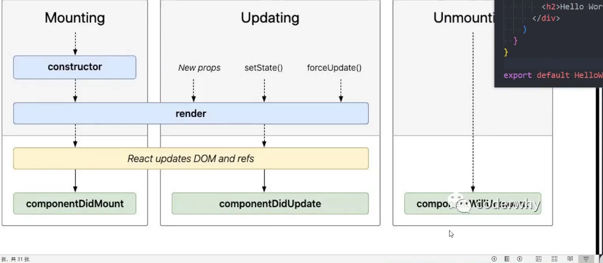
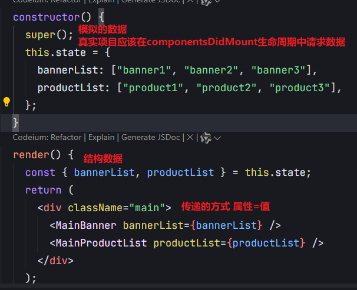
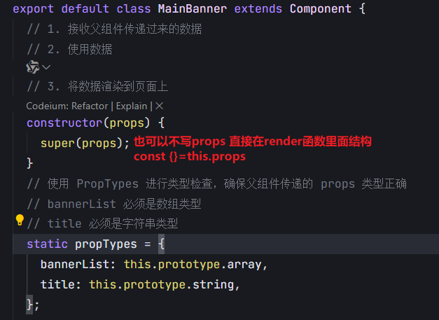
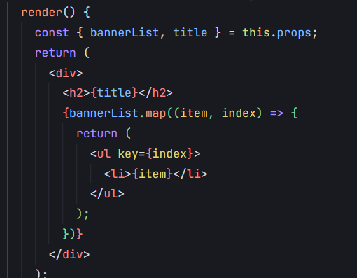
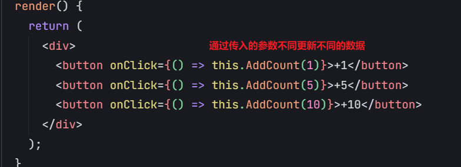
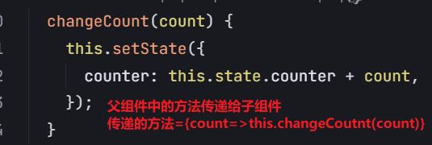
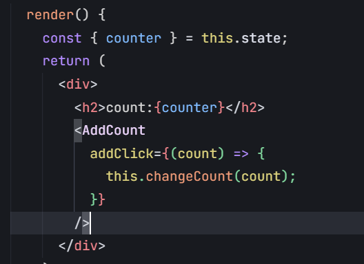
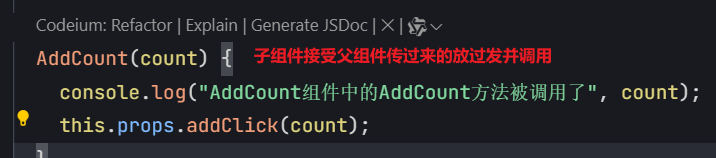

# React18/19

## React 的生命周期

### 第一阶段

1. 执行组件的 constructor 方法 (初始化)
2. 执行组件的 render(渲染) 方法
3. 执行组件的 componentDidMount (挂载到 dom)方法

### 第二阶段

4.组件的 DOM 更新完成 dom 发生变化 componentDidUpdate (更新) 方法 5.组件的 DOM 被移除 componentWillUnmount (卸载) 方法

## 生命周期过程

## 生命周期使用

### 1.componentDidMount()会在组件挂在后插入 dom 树中立即执行

### 2.componentDidMount(){}中可以进行一些初始化操操作

##### 2.1 依赖于 dom 的操作可以在这里进行

##### 2.2 可以进行网络请求，或者定时器操作，但是不要在里面进行 setState 操作，因为 setState 会触发生命周期，导致死循环

##### 2.3 可以在此处添加一些订阅(会在组件卸载时取消订阅)

## 组件的通信

### 1.父组件向子组件传递数据

##### 父组件在展示子组件的时候，可能会传递一些数据给子组件。

##### 1.1 父组件通过属性=值的方式传递给子组件

##### 1.2 子组件通过 props 参数来接受父组件传递过来的数据

### 举例

    <!-- 父组件传递 -->

    <!-- 子组件接受  -->

解构 props

使用 props 的数据并展示

### 2.子组件向父组件传递数据

#### 1.在子组件中监听需要操作,定义一个方法

#### 2.父组件中传入一个方法，并定义一个事件（具体的某一个操作）

#### 3.在子组件当中调用方法，并传入参数也就在子组件监听的方法中调用父组件传入的方法，并传入参数

### 父子组件通信案例
